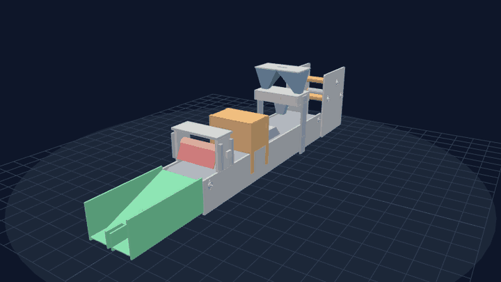
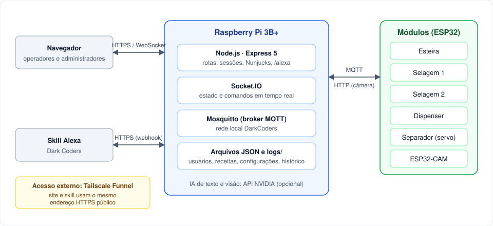
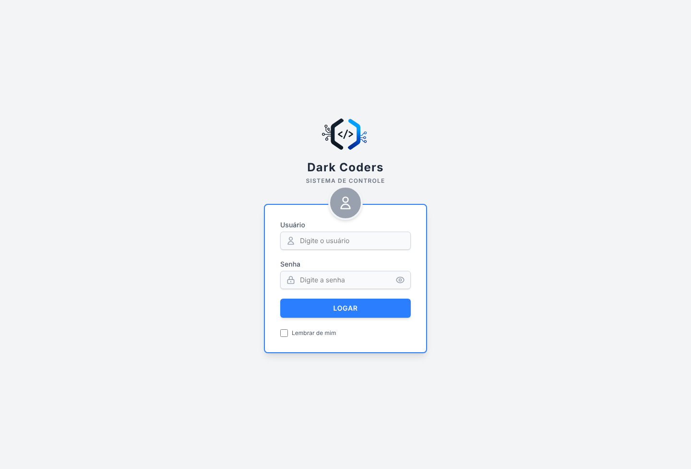

<div align="center">


# Flow Pack: Sistema de Controle

Aplicação web para operar e monitorar uma máquina de embalagem Flow Pack em tempo real.


</div>

<p align="center">
  
</p>

## Visão geral

Projeto da equipe **Dark Coders** (Engenharia da Computação, FIAP) para a **Festo 2026**. O sistema roda em um Raspberry Pi, que se comunica por MQTT com os ESP32 de cada módulo da máquina e entrega uma interface web para operação, acompanhamento da produção e manutenção.

A linha de embalagem é composta por esteira, bobina de filme, dispenser, braço formador, selagem horizontal, selagem final e separador de itens. Cada módulo tem controle individual, indicador de conexão e registro de eventos.

## Funcionalidades

| Módulo | Descrição |
|---|---|
| Operação | Velocidade da esteira, temperatura das selagens, estado dos módulos e modelo 3D da máquina. |
| Painel de Controle | Motores e aquecimento de cada selagem, sentido da esteira, reinício e reset de cada placa. |
| Dispenser | Seleção do grão e da quantidade (1/4, 1/2, 3/4 ou 1 volta do rotor) e acionamento da dosagem. |
| Separador | Contagem e reconhecimento de produtos por câmera, com servo que desvia cada item. Inclui treinamento por classe e calibração de fundo. |
| Visão Computacional | Zona de detecção, produtos de referência e confirmação por IA. |
| Receitas | Níveis de 50, 100, 150 e 200 g com velocidade e temperatura predefinidas. |
| Produção e Relatórios | Gráficos por hora e por dia e exportação de relatórios em PDF. |
| Dark Coders AI | Assistente com base de conhecimento local e IA online opcional. Aceita comandos por texto e por voz. |
| Alexa | Skill própria para comandos (velocidade, temperatura, emergência) e perguntas. |
| Logs ao Vivo | Registro em tempo real de tudo o que acontece, com usuário e origem (site, assistente ou Alexa). |
| Status do Sistema | Internet, Raspberry (temperatura, memória, alimentação) e conexão de cada dispositivo. |
| Usuários | Três níveis de acesso e permissão de telas por usuário. |
| Manuais | Manuais em PDF de cada módulo e da máquina completa. |

A **Parada de Emergência** fica visível em todas as telas e também responde a comandos da Alexa.

<p align="center">
  
  
</p>
<p align="center">
  
  
</p>
<p align="center">
  
  
</p>

### Modelo 3D

A máquina pode ser visualizada em 3D no próprio site (Dashboard e tela Modelo 3D), com rotação, zoom e modo estrutura. O visualizador usa Three.js com os arquivos servidos localmente, então funciona sem internet. O modelo fica em [`public/modelo/maquina.glb`](public/modelo); para trocá-lo, basta substituir o arquivo.

<p align="center">
  
</p>

## Arquitetura

<p align="center">
  
</p>

- **Back-end:** Node.js, Express 5, Socket.IO e Nunjucks.
- **Front-end:** HTML e JavaScript, Tailwind CSS, Chart.js, jsPDF e Three.js, todos servidos localmente.
- **Mensageria:** MQTT, com o broker Mosquitto no próprio Raspberry.
- **Persistência:** arquivos JSON e a pasta `logs/`. Não há banco de dados, o que mantém o consumo baixo para o Raspberry Pi 3B+.
- **IA:** busca por similaridade na base local (`knowledge/`) e, opcionalmente, modelos da NVIDIA para o chat e a visão.

### Tópicos MQTT

| Módulo | Tópicos |
|---|---|
| Esteira | `esteira/velocidade/set`, `esteira/velocidade/atual`, `esteira/sentido/set`, `esteira/sentido/atual`, `esteira/status`, `esteira/emergencia` |
| Selagem 1 | `selagem/set_temperatura`, `selagem/ativar`, `selagem/dados`, `selagem/status_conexao`, `selagem/emergencia`, `selagem/motores/status` |
| Selagem 2 | `selagem2/set_temperatura`, `selagem2/ativar`, `selagem2/dados`, `selagem2/status_conexao`, `selagem2/emergencia`, `selagem2/motor/status` |
| Dispenser | `dispenser/dosar`, `dispenser/estado`, `dispenser/concluido`, `dispenser/status`, `dispenser/reiniciar`, `dispenser/emergencia` |
| Separador | `separador/desviar`, `separador/config`, `separador/estado`, `separador/status`, `separador/teste`, `separador/emergencia` |

## Instalação

### Requisitos

- Node.js 20.6 ou superior
- Broker MQTT acessível (por exemplo, Mosquitto)
- ESP32 dos módulos (opcional para apenas visualizar a interface)

### Passos

```bash
git clone https://github.com/brunoosz/Festo2026.git
cd Festo2026
npm install
cp .env.example .env
npm start
```

A aplicação fica disponível em `http://localhost:5000`. A porta está definida no início do [`server.js`](server.js) e o endereço do broker pode ser trocado pela variável `MQTT_BROKER`.

Na primeira execução, caso não exista `usuarios.json`, é criado o usuário `admin` com senha `admin`. **Altere a senha em Configuração antes de qualquer uso real.**

### Variáveis de ambiente

| Variável | Descrição | Obrigatória |
|---|---|---|
| `NVIDIA_API_KEY` | Chave da API NVIDIA para o chat e a visão por IA. Sem ela, o chat responde apenas com a base local. | Não |
| `SESSION_SECRET` | Segredo das sessões e dos cookies. Se ausente, é gerado e salvo em `.session_secret`. | Não |
| `MQTT_BROKER` | Endereço do broker MQTT. Padrão: `mqtt://192.168.4.1`. | Não |

Para que o Node leia o `.env` automaticamente, use `npm run start:env`.

## Implantação no Raspberry Pi

### Atualização

O script [`atualizar.sh`](atualizar.sh) baixa a versão mais recente do GitHub preservando os dados da máquina: `usuarios.json`, receitas, fotos de referência, configurações, `.env` e logs. Em seguida instala as dependências e reinicia o serviço (pm2 ou systemd).

```bash
cd ~/site_esteira && git fetch origin main && git checkout origin/main -- atualizar.sh && bash atualizar.sh
```

Antes de qualquer alteração, uma cópia dos dados é salva em `../festo2026_backup/`. Para atualizar a partir de outra branch, informe o nome: `bash atualizar.sh nome-da-branch`.

### Acesso externo com Tailscale Funnel

O sistema pode ser acessado fora da rede local por meio do [Tailscale Funnel](https://tailscale.com/kb/1223/funnel), que publica a porta do servidor em um endereço HTTPS:

```bash
sudo tailscale funnel --bg 5000
```

Como a tela de login passa a ficar pública, o servidor aplica as seguintes proteções:

- cookie de "lembrar de mim" assinado, que não pode ser forjado;
- segredo de sessão fora do código-fonte;
- bloqueio por 15 minutos após 8 tentativas de login incorretas a partir do mesmo IP.

Recomendações adicionais estão em [SECURITY.md](SECURITY.md).

## Usuários e permissões

| Nível | Permissões |
|---|---|
| Dono | Acesso total, incluindo promover e apagar usuários. |
| Administrador | Controla a máquina, cria usuários e altera senhas dos níveis abaixo do seu. |
| Operário | Acessa apenas as telas liberadas pelo Dono ou pelo Administrador. |

Em **Usuários**, o Dono ou o Administrador define, para cada Operário, quais telas ficam disponíveis: Dispenser, Separador, Receitas, Produção, Relatórios, Visão Computacional, Dark Coders AI e Logs. Por padrão, o Operário acessa todas, exceto Receitas. Dashboard e Configuração estão sempre liberados. A restrição é aplicada no menu e no servidor, portanto o acesso direto pela URL também é bloqueado.

<p align="center">
  
  
</p>

## Integração com a Alexa

A skill **Dark Coders** envia os pedidos para `POST /alexa`. Antes de executar qualquer comando, o servidor valida a assinatura e o certificado da Amazon e confere o ID da skill. O endereço precisa ser público e usar HTTPS, o que o Tailscale Funnel atende.

## Estrutura do repositório

```
.
├── server.js              Servidor: rotas, MQTT, Socket.IO, Alexa e IA
├── separador_engine.js    Contagem e desvio de produtos do separador
├── atualizar.sh           Atualização do Raspberry Pi
├── views/                 Telas (templates Nunjucks)
├── public/                Arquivos estáticos, bibliotecas e modelo 3D
├── knowledge/             Base de conhecimento do assistente
├── manuais/               Manuais em PDF
├── docs/img/              Imagens usadas neste README
├── dispenser_config.json  Configuração do dispenser
├── config_visao.json      Configuração da câmera e da visão
└── .env.example           Modelo de variáveis de ambiente
```

## Manuais

Os manuais em PDF ficam em [`manuais/`](manuais) e também podem ser baixados pelo botão **Manuais** do próprio sistema.

| Documento | Arquivo |
|---|---|
| Máquina completa | [`Manual_Maquina_FlowPack.pdf`](manuais/Manual_Maquina_FlowPack.pdf) |
| Esteira | [`Manual_Esteira_FlowPack.pdf`](manuais/Manual_Esteira_FlowPack.pdf) |
| Dispenser | [`Manual_Dispenser_FlowPack.pdf`](manuais/Manual_Dispenser_FlowPack.pdf) |
| Braço formador | [`Manual_BracoFormador_FlowPack.pdf`](manuais/Manual_BracoFormador_FlowPack.pdf) |
| Selagem 1 | [`Manual_Selagem1_FlowPack.pdf`](manuais/Manual_Selagem1_FlowPack.pdf) |
| Selagem 2 | [`Manual_Selagem2_FlowPack.pdf`](manuais/Manual_Selagem2_FlowPack.pdf) |

## Contribuição

Consulte [CONTRIBUTING.md](CONTRIBUTING.md) antes de abrir um pull request.

## Licença

Distribuído sob a licença MIT. Consulte o arquivo [LICENSE](LICENSE).
