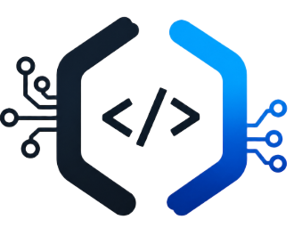
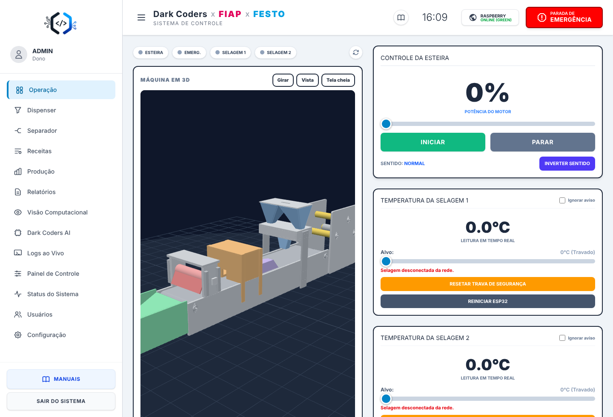
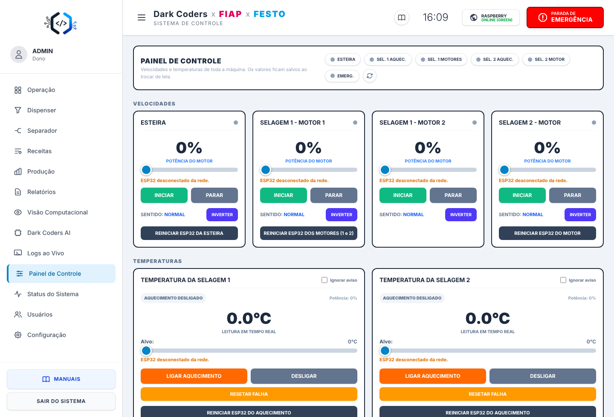
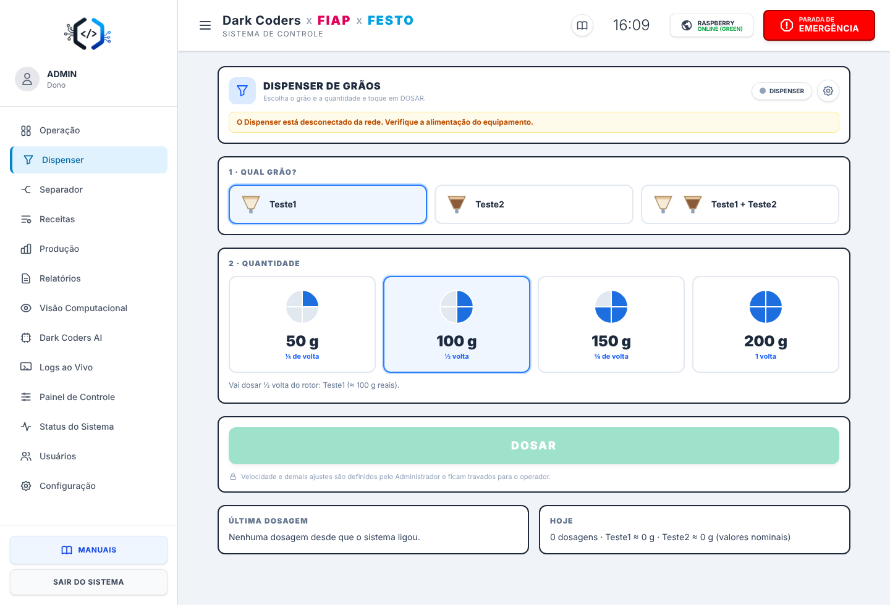
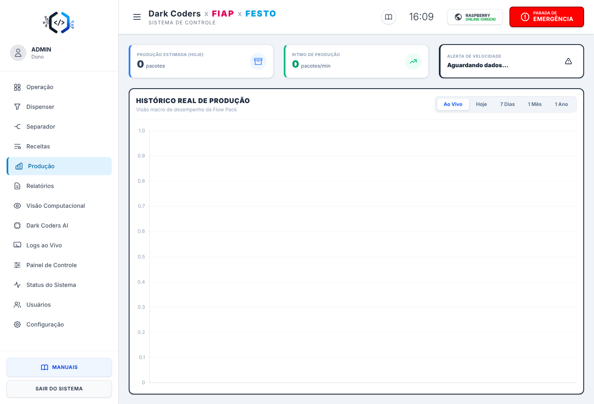
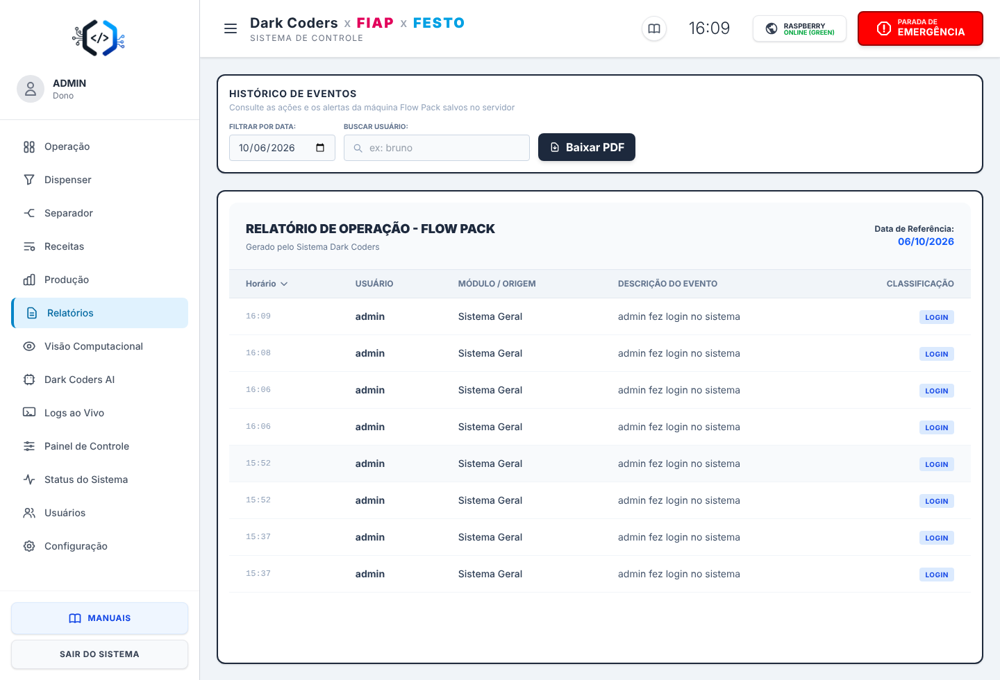
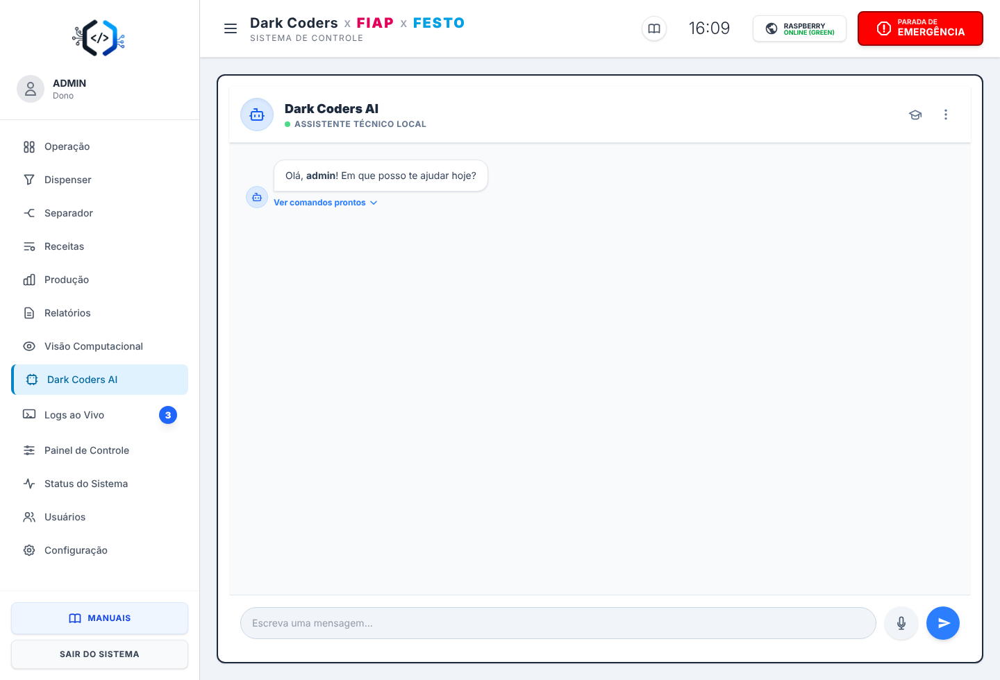
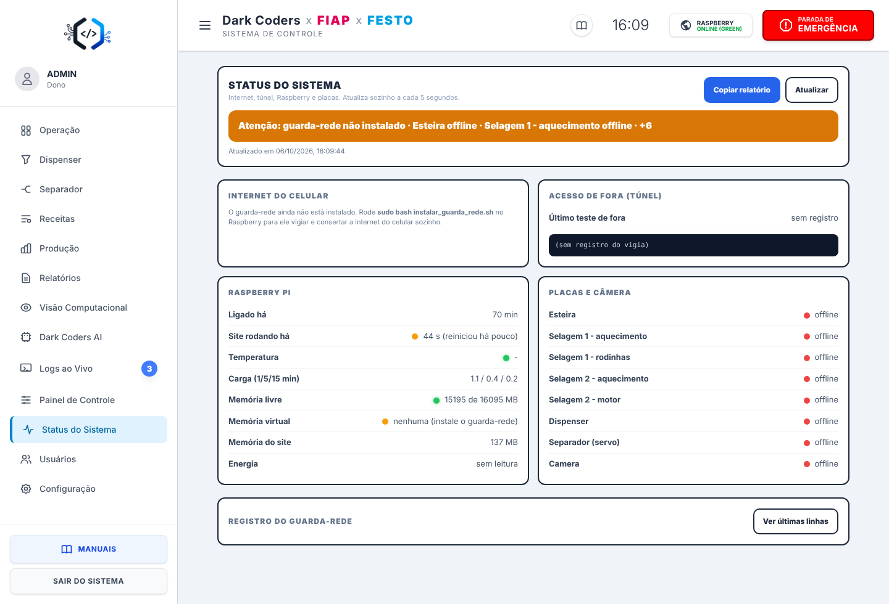
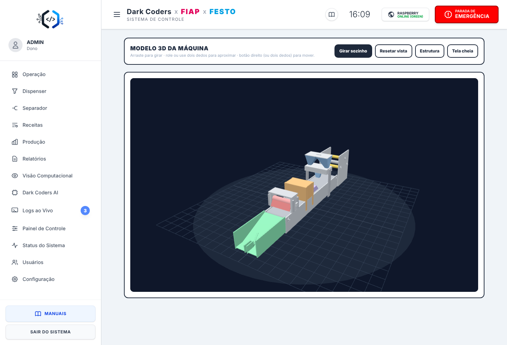
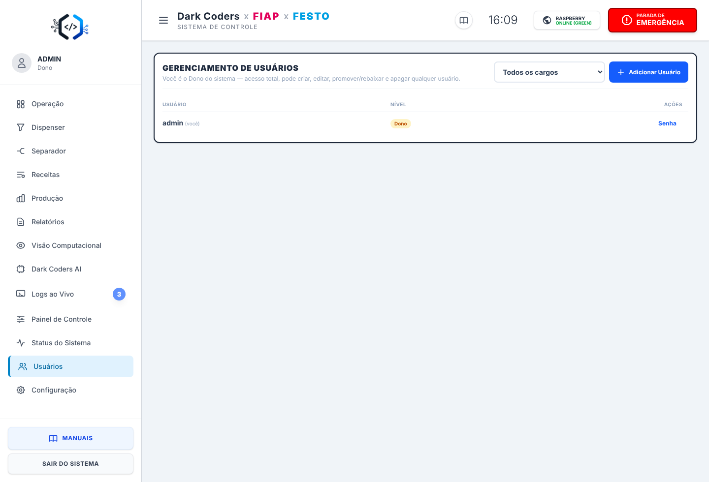

<p align="center">
  
</p>

# Festo 2026 - Flow Pack

Site que controla a nossa máquina de embalagem Flow Pack. A gente fez esse projeto na FIAP, em parceria com a Festo, e ele roda num Raspberry Pi 3B+ ligado às placas ESP32 da máquina por MQTT.

A máquina embala em sequência: esteira, bobina de plástico, dispenser, braço formador, selagem horizontal, selagem final e separador de itens. Pelo navegador dá pra ligar a esteira, ajustar temperatura das selagens, dosar, ver gráficos de produção e até mandar comando por voz pela Alexa.



## O que tem no site

- **Operação:** velocidade da esteira, temperatura das duas selagens, status de cada placa e o modelo 3D da máquina.
- **Painel de Controle:** motores e aquecimento de cada selagem (só Dono e Administrador).
- **Dispenser:** escolhe o grão e a quantidade (1/4, 1/2, 3/4 ou 1 volta) e doza.
- **Separador:** câmera ESP32-CAM que conta e reconhece os produtos, e um servo que desvia cada um pro lado certo.
- **Visão Computacional:** zona de detecção, produtos de referência e confirmação por IA.
- **Receitas:** níveis de 50, 100, 150 e 200 g com velocidade e temperatura prontas.
- **Produção e Relatórios:** gráficos por hora e por dia, com PDF.
- **Dark Coders AI:** chat com base de conhecimento local e, se tiver chave, IA online (NVIDIA). Aceita comando por texto e por voz.
- **Alexa:** skill própria que manda comando (velocidade, temperatura, emergência) e responde perguntas.
- **Logs ao Vivo, Status do Sistema, Usuários, Manuais em PDF** e o botão de **Parada de Emergência** em todas as telas.

<table>
  <tr>
    <td></td>
    <td></td>
  </tr>
  <tr>
    <td></td>
    <td></td>
  </tr>
  <tr>
    <td></td>
    <td></td>
  </tr>
</table>

### Modelo 3D

O modelo da máquina é um arquivo `.glb` em `public/modelo/`. Dá pra girar, aproximar e ver em modo estrutura. Se trocar o arquivo, o site já usa o novo.



## Como funciona

```
Navegador  <-- HTTP / WebSocket -->  Raspberry Pi (Node.js)  <-- MQTT -->  ESP32 de cada módulo
Alexa      <--     HTTPS      -->   /alexa                   <-- HTTP -->  ESP32-CAM
```

- Back-end em Node.js com Express 5, Socket.IO e Nunjucks.
- Front-end em HTML e JavaScript puro, com Tailwind, Chart.js, jsPDF e Three.js (tudo local, funciona sem internet).
- O broker MQTT (Mosquitto) roda no próprio Raspberry.
- Não tem banco de dados: usuários, receitas, configurações e histórico ficam em arquivos JSON e na pasta `logs/`.

## Rodando

Precisa de Node 20.6 ou mais novo e de um broker MQTT. Pra só ver a interface, nem as placas são necessárias.

```bash
git clone https://github.com/brunoosz/Festo2026.git
cd Festo2026
npm install
cp .env.example .env
npm start
```

O site abre em `http://localhost:5000`. O endereço do broker (`mqtt://192.168.4.1`) e a porta estão no começo do `server.js`.

Na primeira vez, se não existir `usuarios.json`, o sistema cria o usuário `admin` com senha `admin`. Troque essa senha logo em **Configuração**.

Variáveis do `.env` (todas opcionais):

| Variável | Pra que serve |
|---|---|
| `NVIDIA_API_KEY` | IA online do chat e da visão. Sem ela, o chat responde só com a base local. |
| `SESSION_SECRET` | Segredo das sessões. Sem ele, o servidor gera um e guarda em `.session_secret`. |

Use `npm run start:env` se quiser que o Node leia o `.env` sozinho.

## No Raspberry

### Atualizar

O `atualizar.sh` baixa a versão nova do GitHub e mantém o que é da máquina: `usuarios.json`, receitas, fotos de referência, configurações, `.env` e logs. Depois instala as dependências e reinicia o site (pm2 ou systemd).

```bash
cd ~/site_esteira && git fetch origin main && git checkout origin/main -- atualizar.sh && bash atualizar.sh
```

Antes de mexer em qualquer coisa ele guarda uma cópia dos dados em `../festo2026_backup/`. Pra atualizar de outra branch: `bash atualizar.sh nome-da-branch`.

### Acesso de fora (Tailscale Funnel)

O site não precisa ficar só na rede local. A gente usa o Tailscale Funnel pra abrir ele por um endereço HTTPS público:

```bash
sudo tailscale funnel --bg 5000
```

Como qualquer pessoa que achar o endereço vê a tela de login, o servidor já se protege:

- o cookie de "lembrar de mim" é assinado, então não dá pra forjar;
- o segredo da sessão não fica no código;
- depois de 8 senhas erradas, o IP fica bloqueado por 15 minutos.

Mesmo assim, troque a senha `admin` antes de abrir pra internet.

## Usuários

| Nível | Pode |
|---|---|
| Dono | Tudo, inclusive promover e apagar usuários. |
| Administrador | Controlar a máquina, criar usuários e trocar senhas dos níveis abaixo. |
| Operário | Só as telas que o Dono ou o Administrador liberarem. |

Em **Usuários** dá pra escolher, pra cada Operário, quais telas ele vê. Por padrão ele vê tudo, menos Receitas. O Dashboard e a Configuração ficam sempre liberados. O bloqueio vale no menu e também no servidor, então digitar a URL direto não adianta.



## Alexa

A skill manda os pedidos pra `POST /alexa`. O servidor confere a assinatura e o certificado da Amazon e o ID da skill antes de executar qualquer coisa. Pra funcionar, o endereço precisa ser HTTPS público (o Funnel serve).

## Pastas

```
server.js              servidor: rotas, MQTT, Socket.IO, Alexa, IA
separador_engine.js    contagem e desvio de produtos do separador
views/                 telas (Nunjucks)
public/                JS, imagens e o modelo 3D
knowledge/             base de conhecimento do chat
manuais/               manuais em PDF de cada módulo
docs/img/              prints usados aqui no README
atualizar.sh           script de atualização do Raspberry
```

## Mais

- Manuais de cada módulo em [`manuais/`](manuais).
- Dicas de segurança pra uso real em [SECURITY.md](SECURITY.md).
- Quer ajudar? Veja [CONTRIBUTING.md](CONTRIBUTING.md).

Feito pela equipe Dark Coders. Licença MIT, está no arquivo [LICENSE](LICENSE).
